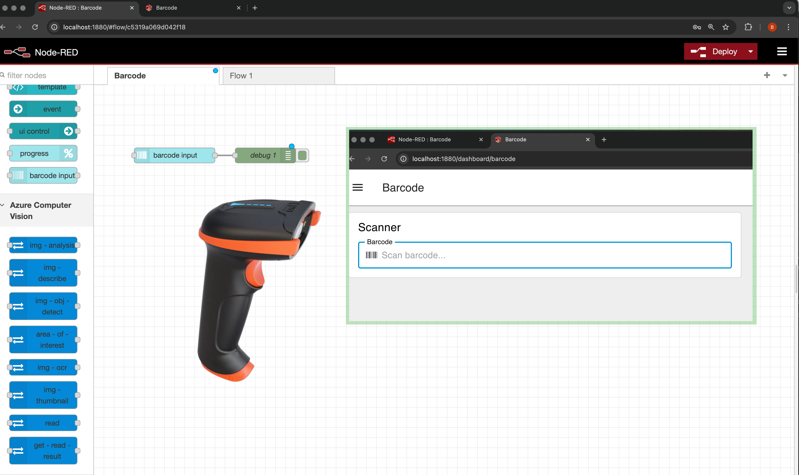

# Barcode Input Widget for Node-RED Dashboard 2.0

[](https://www.npmjs.com/package/node-red-dashboard-2-ui-barcode-input)
[](https://opensource.org/licenses/Apache-2.0)

A specialized input widget for [Node-RED Dashboard 2.0](https://github.com/FlowFuse/node-red-dashboard) designed specifically for USB barcode scanner integration in industrial IoT and automation applications.



## Key Features

### 🎯 Persistent Focus Management
The widget automatically maintains focus on the input field, ensuring that barcode scanner input is **always captured** regardless of user interactions with other dashboard elements. This eliminates the common problem of "lost scans" when operators inadvertently click elsewhere on the dashboard.

### ⚡ Optimized for USB Scanners
- **Universal HID Support:** Works with all USB HID barcode scanners
- **Multiple Symbologies:** Supports EAN, Code 128, QR Code, Data Matrix, and more
- **Instant Output:** Enter key automatically triggers message output
- **Configurable Auto-clear:** Optionally clears input field after each scan

### 🎨 Professional Appearance
- Material Design icon integration
- Customizable label and placeholder text
- Rounded input field with subtle shadow effect
- Fully responsive and consistent with Dashboard 2.0 design language

## Installation

### Via Node-RED Palette Manager (Recommended)
1. Open Node-RED editor
2. Click Menu (☰) → Manage palette
3. Switch to "Install" tab
4. Search for `node-red-dashboard-2-ui-barcode-input`
5. Click "Install"

### Via npm
```bash
cd ~/.node-red
npm install node-red-dashboard-2-ui-barcode-input
```

Restart Node-RED after installation.

## Quick Start

1. Drag the **Barcode Input** node from the Dashboard 2.0 palette onto your flow
2. Double-click to configure
3. Select a Dashboard group
4. Configure label and placeholder text (optional)
5. Connect the output to your processing logic
6. Deploy and navigate to your Dashboard

The widget will automatically capture barcode scanner input and send the scanned value as `msg.payload`.

## Configuration

### Node Properties

| Property | Type | Default | Description |
|----------|------|---------|-------------|
| **Name** | string | - | Optional node name for identification in Node-RED |
| **Group** | ui-group | - | Dashboard group where widget will be displayed (required) |
| **Size** | object | auto | Width and height in grid units |
| **Label** | string | "Barcode" | Text label displayed with input field |
| **Placeholder** | string | "Scan barcode..." | Hint text shown when input is empty |
| **Icon** | string | "barcode" | Material Design icon name (without "mdi-" prefix) |
| **Icon Position** | string | "left" | Icon position relative to label: "left" or "right" |
| **Icon Inner Position** | string | "inside" | Icon position relative to input box: "inside" or "outside" |
| **Clear on Send** | boolean | true | Automatically clear input after sending message |

### Icon Examples

The widget supports all Material Design Icons. Some popular choices for barcode applications:

- `barcode` - Standard barcode icon (default)
- `barcode-scan` - Barcode with scan line
- `qrcode` - QR code icon
- `qrcode-scan` - QR code with scan frame
- `package-variant` - Package/box icon

**Note:** Do not include the "mdi-" prefix when specifying icons.

## Output Format

When a barcode is scanned (Enter key pressed), the widget outputs:

```javascript
{
    payload: "scanned_barcode_value"  // String, trimmed of whitespace
}
```

## Usage Examples

### Basic Inventory Tracking

```
[Barcode Input] → [Function: Lookup Item] → [Database Query] → [Display Result]
```

### Quality Control Station

```
[Barcode Input] → [Switch: Route by Product Type] → [Product-Specific Tests]
                                                   ↓
                                          [Store Results] → [Dashboard Display]
```

### Warehouse Picking System

```
[Barcode Input] → [Validate Against Order] → [Update Pick List] → [Send to WMS]
```

## Technical Details

### Focus Management Mechanism

The widget employs three complementary techniques to maintain persistent focus:

1. **Initial Auto-focus:** Focus is set immediately when the component mounts
2. **Blur Event Handler:** Automatically refocuses if focus is lost
3. **Global Click Handler:** Intercepts all page clicks and refocuses the input field

This triple-redundant approach ensures reliable operation in production environments where operators may inadvertently interact with other dashboard elements.

### Browser Compatibility

The widget is built on Vue 3 and Vuetify 3, providing excellent cross-browser compatibility:

- Chrome/Edge (Chromium) 90+
- Firefox 88+
- Safari 14+

### Scanner Compatibility

Compatible with all USB HID barcode scanners that emulate keyboard input, including:

- Handheld barcode scanners
- Fixed-mount industrial scanners
- 2D imagers
- Omnidirectional presentation scanners
- Wireless scanners with USB dongles

## Typical Applications

- **Manufacturing:** Production line tracking, work-in-progress monitoring
- **Warehousing:** Inventory management, picking and packing operations
- **Retail:** Point-of-sale systems, inventory audits
- **Healthcare:** Patient identification, medication tracking
- **Logistics:** Shipment tracking, proof of delivery
- **Asset Management:** Equipment tracking, maintenance logging

## Development

### Building from Source

```bash
git clone https://github.com/flowfuse/node-red-dashboard-2-ui-barcode-input.git
cd node-red-dashboard-2-ui-barcode-input
npm install
npm run build
```

### Development Mode

```bash
npm run dev
```

This starts Vite in watch mode, automatically rebuilding when source files change.

### Local Testing

```bash
cd ~/.node-red
npm install /path/to/node-red-dashboard-2-ui-barcode-input
```

Restart Node-RED to load the updated widget.

## Contributing

Contributions are welcome! Please:

1. Fork the repository
2. Create a feature branch
3. Make your changes
4. Add/update tests if applicable
5. Submit a pull request

## Support

- **Issues:** [GitHub Issues](https://github.com/flowfuse/node-red-dashboard-2-ui-barcode-input/issues)
- **Discussions:** [Node-RED Forum](https://discourse.nodered.org/)
- **Documentation:** [Node-RED Dashboard 2.0 Docs](https://dashboard.flowfuse.com/)

## License

Apache License 2.0 - See [LICENSE](LICENSE) file for details

## Author

**Boris Crismancich**
- GitHub: [@crismancich](https://github.com/crismancich)
- Company: [KUNBUS GmbH](https://www.kunbus.com/)

## Acknowledgments

Built for the [Node-RED Dashboard 2.0](https://github.com/FlowFuse/node-red-dashboard) framework by FlowFuse.

---

Made with ❤️ for the Node-RED community
